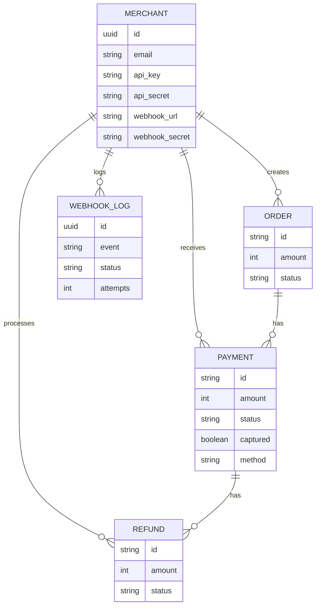

# PayPoint System Documentation

## 1. Database Schema

The system uses PostgreSQL with the following relational schema:



### **Merchants Table**
- `webhook_url` (Text): URL for event notifications.
- `webhook_secret` (String): Secret for HMAC signature.

### **Refunds Table**
- `id`: `rfnd_` prefix.
- `payment_id`: Associated payment.
- `status`: `pending`, `processed`.

### **Webhook Logs Table**
- `event`: `payment.success`, `refund.processed`, etc.
- `status`: `pending`, `success`, `failed`.
- `next_retry_at`: Scheduled retry time.

### **Idempotency Keys Table**
- `key`: Unique client-provided key.
- `response`: Cached API response.
- `expires_at`: 24h expiration.

---

## 2. API Reference

**Base URL:** `http://localhost:8000`

### **Health Check**
- **GET** `/health`
- **Auth:** None
- **Response:**
  ```json
  {
    "status": "healthy",
    "database": "connected",
    "timestamp": "2024-01-01T12:00:00Z"
  }
  ```

### **1. Create Order**
- **POST** `/api/v1/orders`
- **Auth:** Basic Auth (Headers: `X-Api-Key`, `X-Api-Secret`)
- **Body:**
  ```json
  {
      "amount": 1000,
      "currency": "INR",
      "receipt": "r_123"
  }
  ```
- **Response (201 Created):**
  ```json
  {
      "id": "order_12345678",
      "amount": 1000,
      "currency": "INR",
      "status": "created"
  }
  ```

### **2. Public Order Fetch**
- **GET** `/api/v1/orders/:orderId/public`
- **Auth:** None (Used by Checkout Page)
- **Response:** Order details required for rendering checkout.

### **3. Initiate Payment (Async)**
- **POST** `/api/v1/payments/public`
- **Response:**
  ```json
  {
      "id": "pay_98765432",
      "status": "pending"
  }
  ```
- **Note:** Status is `pending`. Processing happens in background via Job Queue.

### **4. Payments Capture & Refund**

#### **Capture Payment**
- **POST** `/api/v1/payments/:id/capture`
- **Body:** `{ "amount": 50000 }`
- **Response:** Updated payment object.

#### **Create Refund**
- **POST** `/api/v1/payments/:id/refunds`
- **Body:** `{ "amount": 5000, "reason": "requested" }`
- **Response:** Refund object with status `pending`.

#### **Get Refund Status**
- **GET** `/api/v1/refunds/:id`

### **5. Webhook Management**

- **GET** `/api/v1/webhooks`: List webhook delivery logs.
- **POST** `/api/v1/webhooks/:id/retry`: Manually retry a failed webhook.
- **POST** `/api/v1/merchants/webhook-config`: Update webhook URL.

---

## 3. Webhook Integration

Failures are retried 5 times with exponential backoff.

**Events:** `payment.success`, `payment.failed`, `refund.processed`.

**Payload Format:**
```json
{
  "event": "payment.success",
  "timestamp": 1705315870,
  "data": {
    "payment": {
      "id": "pay_H8sK3jD9s2L1pQr",
      "status": "success",
      "amount": 50000,
      ...
    }
  }
}
```

**Signature Verification:**
Verify `X-Webhook-Signature` header using HMAC-SHA256 with your `webhook_secret`.

---

## 4. SDK Integration

Embed the checkout widget in your website using our Javascript SDK.

1. **Include the Script:**
   ```html
   <script src="http://localhost:3001/checkout.js"></script>
   ```

2. **Initialize & Open:**
   ```javascript
   const checkout = new PaymentGateway({
     key: 'key_test_abc123',
     orderId: 'order_12345678',
     onSuccess: (response) => {
       console.log("Payment Success:", response.paymentId);
     },
     onFailure: (error) => {
       console.error("Payment Failed:", error);
     }
   });
   
   checkout.open();
   ```
