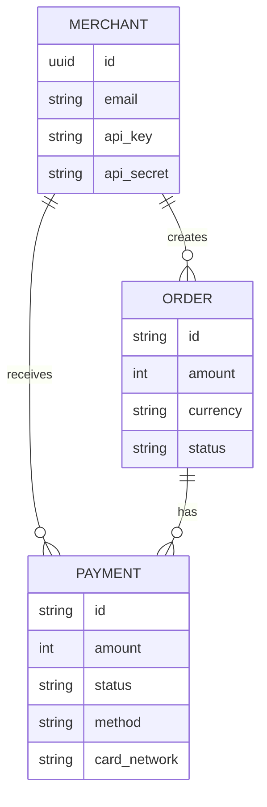

# PayPoint System Documentation

## 1. Database Schema

The system uses PostgreSQL with the following relational schema:



### **Merchants Table**
Stores merchant credentials and authentication details.
- `id` (UUID, PK): Unique identifier.
- `name` (String): Merchant name.
- `email` (String, Unique): Login email.
- `api_key` (String, Unique): Public key for API auth.
- `api_secret` (String): Private key for API auth.
- `is_active` (Boolean): Account status.

### **Orders Table**
Represents a payment request created by a merchant.
- `id` (String, PK): Format `order_XXXXXXXXXXXXXXXX`.
- `merchant_id` (UUID, FK): Links to Merchants.
- `amount` (Integer): Amount in paise (e.g., 50000 = ₹500).
- `currency` (String): Default 'INR'.
- `status` (String): `created` | `paid`.
- `receipt` (String): Merchant's internal reference.

### **Payments Table**
Represents a transaction attempt for an order.
- `id` (String, PK): Format `pay_XXXXXXXXXXXXXXXX`.
- `order_id` (String, FK): Links to Orders.
- `merchant_id` (UUID, FK): Links to Merchants.
- `amount` (Integer): Transaction amount.
- `method` (String): `upi` | `card`.
- `status` (String): `processing` -> `success` / `failed`.
- `vpa` (String): Stored only for UPI.
- `card_network` (String): Visa/Mastercard (for Cards).
- `card_last4` (String): Last 4 digits (for Cards).

---

## 2. API Reference

**Base URL:** `http://localhost:8000`

### **Health Check**
- **GET** `/health`
- **Auth:** None
- **Response:**
  ```json
  {
    "status": "healthy",
    "database": "connected",
    "timestamp": "2024-01-01T12:00:00Z"
  }
  ```

### **1. Create Order**
- **POST** `/api/v1/orders`
- **Auth:** Basic Auth (Headers: `X-Api-Key`, `X-Api-Secret`)
- **Body:**
  ```json
  {
      "amount": 1000,
      "currency": "INR",
      "receipt": "r_123"
  }
  ```
- **Response (201 Created):**
  ```json
  {
      "id": "order_12345678",
      "amount": 1000,
      "currency": "INR",
      "status": "created"
  }
  ```

### **2. Public Order Fetch**
- **GET** `/api/v1/orders/:orderId/public`
- **Auth:** None (Used by Checkout Page)
- **Response:** Order details required for rendering checkout.

### **3. Initiate Payment**
- **POST** `/api/v1/payments/public`
- **Auth:** None
- **Body:**
  ```json
  {
      "order_id": "order_12345678",
      "method": "upi",
      "vpa": "user@okicici"
  }
  ```
- **Response (201 Created):**
  ```json
  {
      "id": "pay_98765432",
      "status": "processing"
  }
  ```